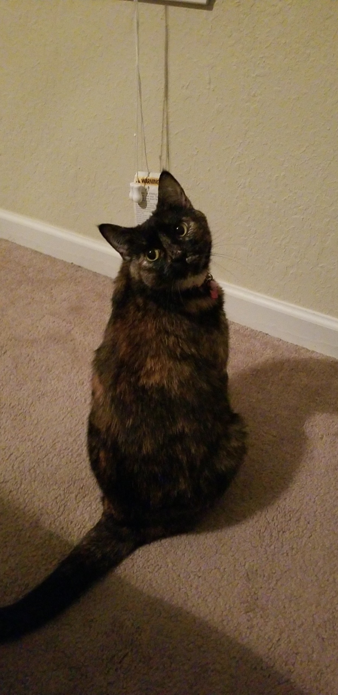

## Steven's Furry Friends ##

#### Below is a list of all my pets ####

All together I have five pets that currently live with me. Here is a table to display all the different types of pets I have:

Species | Quantity
--- | ---
Dogs | 1
Cats | 2
Guinea Pigs | 2


---

My pets are:

* Tess *the dog*
* Oliver *the cat*
* Kali *the cat*
* Dean *the guinea pig*
* Sam *the guinea pig*


Although I love all my animals, here is how I would rank them:

1. Kali
2. Oliver
3. Dean
4. Sam
5. Tess


***

Here is a picture of my cat **Kali** 


>Kali is may favorite because she has lived with me the longest out of all my pets.
>She can be so sweet and cuddly, despite her ~~mean streak~~.


```C
#include <stdio.h>
int main()
{
   printf("Kali is my favorite pet!");
   return 0;
}
```

***

Despite already having five pets, I do wish that I had a bearded dragon like this one:


Considering all my current pets are mammals, I learned good ways to take care of reptiles from [here.](<http://www.reptilesmagazine.com/Care-Sheets/Lizards/Bearded-Dragon/>)

***


***

To return to the home page click [here.](<https://github.com/StevenVaughan97/Pets/blob/master/README.md>)